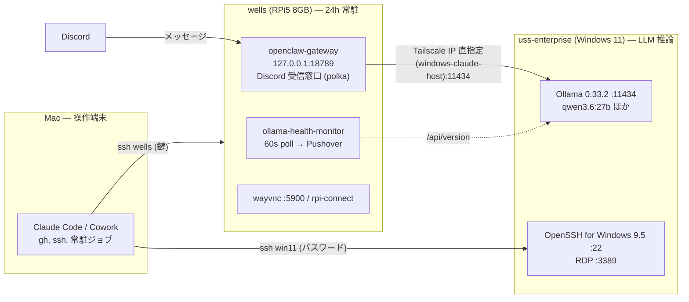

# openclaw-rpi5-ops

Raspberry Pi 5（`wells`）上の **OpenClaw Gateway + Discord Bot「polka」** を、Windows タワー（`uss-enterprise`）の self-hosted LLM（Ollama）をバックエンドにして 24h 運用するためのリポジトリ。運用スクリプト・systemd ユニット・Zenn 連載記事（`articles/`）を同梱する。

本 README の「環境一覧」は **2026-09-16 に Mac / wells から実測**した値（`ssh` / `tailscale status` / `systemctl` / Ollama API）。実測できなかった項目は出典を明記している。ユーザー名・LAN アドレス等の識別情報は伏せている（`<user>` / `192.168.x.x` 等）。

## 全体構成



- **入力（Discord 受信）は wells、推論は uss-enterprise** の非対称分担（ADR: `docs/adr/2026-05-05-discord-entry-architecture.md`、記事 #6）
- wells は 8GB RAM のため 27B モデルはロード不能（~17GB）。頭脳は外部、wells は窓口、という設計を維持する
- 全ホストは **Tailscale** で同一 tailnet（MagicDNS 有効。`ssh wells` は MagicDNS 名で解決）

## 環境一覧（2026-09-16 実測）

| ホスト | 実体 | OS | CPU / RAM / Disk | ネットワーク | 役割 |
|---|---|---|---|---|---|
| Mac | MacBook Pro (MacBookPro18,2) | macOS 26.5.2 | Apple M1 Max / 32 GB / 926 GB SSD | Tailscale | 操作端末（Claude Code / Cowork / 自律ループの常駐ジョブ） |
| `wells` | Raspberry Pi 5 Model B Rev 1.1 | Debian 13 trixie (6.18.34+rpt-rpi-2712 aarch64) | Cortex-A76 ×4 / 8 GB / NVMe 234 GB (使用 22 GB) | Tailscale + LAN (192.168.x.x) | OpenClaw Gateway・Discord 受信・監視・別リポの cron |
| `uss-enterprise` | Windows タワー（Tailscale 名 `windows-claude-host`） | Windows 11 | Ryzen 7 7700 / DDR5-5600 32 GB / RTX 4070 Ti SUPER 16 GB VRAM ※ | Tailscale（MagicDNS 名 `windows-claude-host`。wells 側は IP 直指定、`win-ollama` は Mac の SSH エイリアス）+ LAN (192.168.x.x) | Ollama LLM バックエンド・Claude Code（Windows 側） |
| iPhone | iPhone | iOS | — | Tailscale | 操作端末 |

※ uss-enterprise のハードウェア諸元は SSH 鍵未登録のため今回は未実測。値は [Issue #14](https://github.com/miyashita337/openclaw-rpi5-ops/issues/14) の実機ベンチ記録（`nvidia-smi` 観測、driver 591.86 当時）による。

### `win11` = `windows-claude-host` = `uss-enterprise` の同一性

Mac の `ssh win11` は LAN アドレス宛て、wells / OpenClaw が使う `win-ollama` は Tailscale アドレス宛てだが、**両アドレスの SSH ホスト鍵（ED25519）フィンガープリントが一致**することを wells から `ssh-keyscan` で確認済み → 同一機。RDP TLS 証明書 CN `uss-enterprise` による検証（2026-07-05、Epic #34）とも整合する。

> 旧設計ドキュメントにあるホスト名 `LAPTOP-9CPJP82V` と旧 LAN アドレス（別セグメント）は現状と一致しない（ホスト名変更・LAN 再編前の値）。

## 各ホストの詳細

### Mac

| 項目 | 値 |
|---|---|
| ツール | Homebrew 6.0.5 / node 25.8.1 / npm 11.11.0 / python3 3.10.17 / uv 0.7.19 / gh 2.97.0 / Claude Code 2.1.273 / codex-cli 0.150.1 / Docker 24.0.2 / tmux 3.6a / jq 1.8.1 / git 2.42.0 |
| Ollama | なし（推論は uss-enterprise に委譲） |
| Remote Login | sshd :22 有効（wells から到達可） |
| launchd（自前） | corp 秘書系（secretary / watchdog / board / dispatch）、claude-hub 系（supervisor / bot / gc）、agent-base 系（liveness / tailscale-reauth-watch）、token-analyzer（daily / weekly）。定義は各リポ側 |
| SSH エイリアス | `wells` → `<user>@wells`（鍵認証 OK）／ `win11` → `<winuser>@<LAN IP>`（パスワード認証）／ `uss-enterprise` `win-ollama` `windows-claude-host` → `<user>@…`（鍵未登録、BatchMode で `Permission denied`） |
| 関連リポ | 本リポ / `agent-base` / `corp` / `claude-hub` / `team_salary` / `claude-context-manager` / `oci_develop` |

### RPi5 `wells`

| 項目 | 値 |
|---|---|
| ハード | Raspberry Pi 5 Model B Rev 1.1、8 GB、NVMe SSD 234 GB（`/dev/nvme0n1p2`、使用 10%） |
| OS | Debian GNU/Linux 13 (trixie)、kernel `6.18.34+rpt-rpi-2712`、aarch64 |
| 稼働 | uptime 10 日（2026-09-16 時点）、load avg ≈ 0 |
| ネットワーク | Tailscale 1.102.2、LAN 192.168.x.x、IPv6 あり |
| ツール | node 22.23.1 / npm 10.9.8 / **OpenClaw 2026.5.4 (b8f6e16)** / python3 3.13.5 / git 2.47.3 / gh 2.97.0 / Claude Code 2.1.273 / rpi-connect 2.12.0（Docker・Ollama なし） |
| リポ | `~/agent-base` / `~/openclaw`（openclaw/openclaw upstream）/ `~/team_salary` |

#### systemd（system）

| ユニット | 状態 | 内容 |
|---|---|---|
| `openclaw-gateway.service` | running / enabled | `/usr/local/bin/openclaw gateway --bind loopback --port 18789 --auth token --allow-unconfigured`。専用ユーザー `openclaw`、`HOME=/var/lib/openclaw`、`EnvironmentFile=/etc/openclaw/openclaw.env`。Tier A/B/B-2/C の systemd hardening（`ProtectSystem=strict`、`SystemCallFilter`、`MemoryMax=2G` 等。記事 #5）。ユニット本体は `etc/systemd/system/openclaw-gateway.service` |
| `discord-ollama-bridge.service` | **disabled / inactive** | Discord ↔ Ollama 最小 forward bot（#11 Phase 2、`/opt/discord-ollama-bridge/`、専用ユーザー `discord-bridge`）。OpenClaw 経由で E2E 成立後は停止中 |
| `tailscaled.service` | running | Tailscale |
| `wayvnc.service` / `wayvnc-control.service` | running | VNC（`*:5900`）。記事 #3 |
| `sshd.service` | running | `0.0.0.0:22` |

#### systemd（user）

| ユニット | 内容 |
|---|---|
| `ollama-health-monitor.service` | `~/ollama-health-monitor/monitor.sh`（本リポ `scripts/ollama-health-monitor.sh` のコピー）。`win-ollama` の `/api/version` を 60 秒間隔でポーリングし、DROP / RECOVER を Pushover 通知（#36）。ログ `~/ollama-health-monitor/health.log` |
| `rpi-connect.service` / `rpi-connect-wayvnc.service` | Raspberry Pi Connect（リモートデスクトップ） |
| `network-monitor.service` | ネットワーク監視 |

#### crontab

`team_salary` リポの自動運用ジョブ（朝の preflight / 日次リリース / トークン更新 / 15 分ごとの承認監視）が wells に常設されている。本リポ外のため詳細はそちらを参照。

#### listen ポート

`127.0.0.1:18789`（OpenClaw gateway）/ `127.0.0.1:18791`（所有プロセス未確認。gateway と同時に立つため OpenClaw 系と推定）/ `0.0.0.0:22`（sshd）/ `*:5900`（wayvnc）/ `:111`（rpcbind）/ Tailscale 用ポート

### Windows `uss-enterprise`

| 項目 | 値 | 出典 |
|---|---|---|
| ホスト名 | `uss-enterprise`（Tailscale 登録名 `windows-claude-host`） | RDP 証明書 CN（#34）/ `schtasks` principal `uss-enterprise\<user>`（#17） |
| ハード | Ryzen 7 7700 / DDR5-5600 32 GB / RTX 4070 Ti SUPER 16 GB | #14 実機ベンチ記録（未実測） |
| Ollama | **v0.33.2**（Windows native）、`:11434` を Tailscale / LAN に公開 | 2026-09-16 `/api/version` 実測 |
| モデル | `qwen3.6:27b` 17.8 GB（polka のメイン）/ `qwen3.8:27b` 17.7 GB / `qwen3:14b` 9.3 GB / `qwen3.5:9b` 6.6 GB / `qwen3.5-cc:9b` 6.6 GB | 2026-09-16 `/api/tags` 実測 |
| 常駐化 | `schtasks OllamaServe`（ONLOGON 起動）で SSH 切断後も listen 継続 | #17 |
| 開放ポート | 22（OpenSSH for Windows 9.5）/ 3389（RDP）/ 11434（Ollama）/ 8080（用途未特定）。5985（WinRM）は closed | 2026-09-16 wells から実測 |
| SSH 鍵認証 | **未登録**（Mac・wells いずれからも `Permission denied (publickey,password)`）。`ssh win11` はパスワード認証 | #37 |
| 実測性能 | qwen3.6:27b ロード ~25 s、生成 ~4.7 tok/s（wells 経由）。VRAM 16 GB をわずかに超えるため GPU/CPU 自動 split | #34 / #14 |

**稼働履歴**: 2026-05〜07 に 38 日間オフライン（polka 沈黙、#34）。2026-09-16 時点の監視ログでも `RECOVER downtime=393h06m`（≈16 日）を記録しており、**常時稼働化（スリープ無効・自動起動・WoL）は #37 で未完了**。gateway journal には直近 30 日で `win-ollama` への `ETIMEDOUT` が 2,900 件超。

### その他

- **OCI Always Free VM**: 別リポ `oci_develop` で管理（本 README の対象外）
- **旧構成メモ**: `docs/openclaw_rpi5_project_overview.md`（gitignore、ローカルのみ）。Mac を「M2 Pro」と記載しているが実機は M1 Max。数値は本 README を正とする

## 接続マトリクス（2026-09-16 実測）

| 経路 | 結果 |
|---|---|
| Mac → wells :22 | `ssh wells` 鍵認証 OK |
| Mac → uss-enterprise :22 | TCP OPEN。鍵認証 NG（`ssh win11` はパスワード） |
| wells → uss-enterprise :11434 | HTTP 200（Ollama 0.33.2） |
| wells → uss-enterprise :22 / :3389 | TCP OPEN。鍵認証 NG |
| wells → uss-enterprise :5985 | closed |
| wells → Mac :22 | TCP OPEN（Remote Login 有効） |
| wells → 旧 LAN アドレス | 不通（現在は無効） |

## リポジトリ構成

| パス | 内容 |
|---|---|
| `articles/` | Zenn 記事（`npx zenn preview` でローカルプレビュー） |
| `etc/systemd/system/openclaw-gateway.service` | wells に配備している gateway ユニット（hardening 込み） |
| `etc/discord-ollama-bridge/env.example` | forward bot の環境変数テンプレート |
| `scripts/ollama-health-monitor.sh` | win-ollama 監視（wells の user unit から実行、#36） |
| `scripts/discord-ollama-bridge.py` | Discord ↔ Ollama 最小 forward bot（#11） |
| `scripts/bench-llm-runtime.sh` / `bench-ollama-native.{sh,py}` / `llm-bench-prompts/` | Qwen3.6-27B の runtime 比較・native API ベンチ（#14 / #17） |
| `scripts/cowork-bootstrap.sh` / `setup-agent-base.sh` | Cowork サンドボックス初期化 / SessionStart 用 agent-base セットアップ |
| `scripts/verify-wayvnc.sh` / `clipsave.sh` / `gh-wrapper.py` | wayvnc 検証 / クリップボード画像保存 / gh ラッパー |
| `docs/adr/` | ADR（Discord 受信アーキテクチャ） |
| `docs/`（それ以外） | gitignore 済みの内部メモ（実装チェックリスト・設計 spec・記事レビュー） |
| `.claude/settings.json` | Claude Code の permission（`ssh wells` 許可、`cat`/`curl`/`sudo` 等 deny） |

## よく使う操作

```bash
# wells の gateway 状態
ssh wells 'systemctl status openclaw-gateway --no-pager; journalctl -u openclaw-gateway -n 50 --no-pager'

# win-ollama の死活（wells 経由）。監視スクリプトと同じく HTTP 4xx/5xx も失敗扱い（-f）にし、
# curl の終了コードをそのまま返す。ホスト名は Tailscale MagicDNS 名（scripts/ollama-health-monitor.sh の TARGET_URL と同一機）
ssh wells 'curl -sf -m 5 http://windows-claude-host:11434/api/version; rc=$?; echo; tail -5 ~/ollama-health-monitor/health.log; exit "$rc"'

# Windows 側へ（パスワード認証。鍵登録は #37）
ssh win11

# Zenn 記事プレビュー
npx zenn preview
```

## Zenn 連載

| 記事 | 状態 |
|---|---|
| #3 リモートデスクトップ（TigerVNC vs Pi Connect） — `articles/rpi5-trixie-pi-connect-wayvnc.md` | draft |
| #5 OpenClaw 導入 — systemd hardening でスコア 9.0→1.4 — `articles/openclaw-05-openclaw-install.md` | draft |
| #6 Discord ハイブリッド経路（RPi5 受け / Windows LLM） — `articles/openclaw-06-discord-hybrid.md` | draft |
| Tailscale で外出先から RPi5 に SSH — `articles/rpi5-tailscale-ssh-magicdns.md` | draft |
| RPi5 Chromium 真っ白問題（Gnome Keyring） — `articles/rpi5-chromium-keyring-whitescreen.md` | draft |

## 関連 Issue

- [#34](https://github.com/miyashita337/openclaw-rpi5-ops/issues/34) Epic: win-ollama (uss-enterprise) バックエンド復旧の完了と再発防止
- [#36](https://github.com/miyashita337/openclaw-rpi5-ops/issues/36) win-ollama ヘルスチェック監視 + Pushover 通知（完了）
- [#37](https://github.com/miyashita337/openclaw-rpi5-ops/issues/37) uss-enterprise 常時稼働化: SSH 経路整備・スリープ無効・自動起動（未完了）
- [#14](https://github.com/miyashita337/openclaw-rpi5-ops/issues/14) Qwen3.6-27B runtime 選定ベンチ / [#17](https://github.com/miyashita337/openclaw-rpi5-ops/issues/17) Windows タワー Ollama 常時公開
- [#11](https://github.com/miyashita337/openclaw-rpi5-ops/issues/11) Discord ↔ Ollama 最小 forward bot
