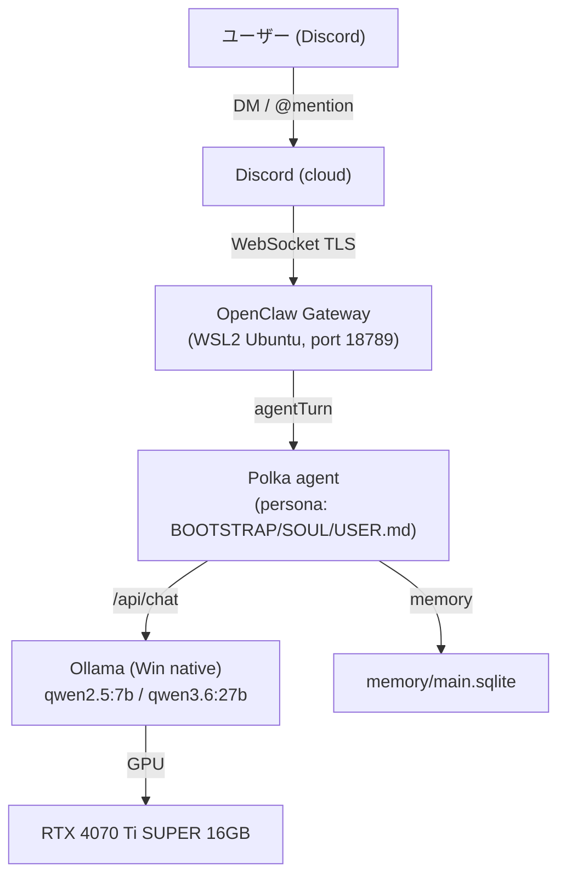
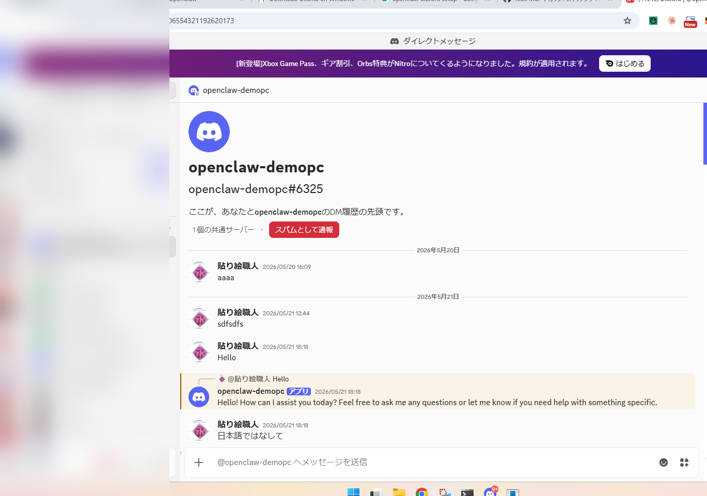
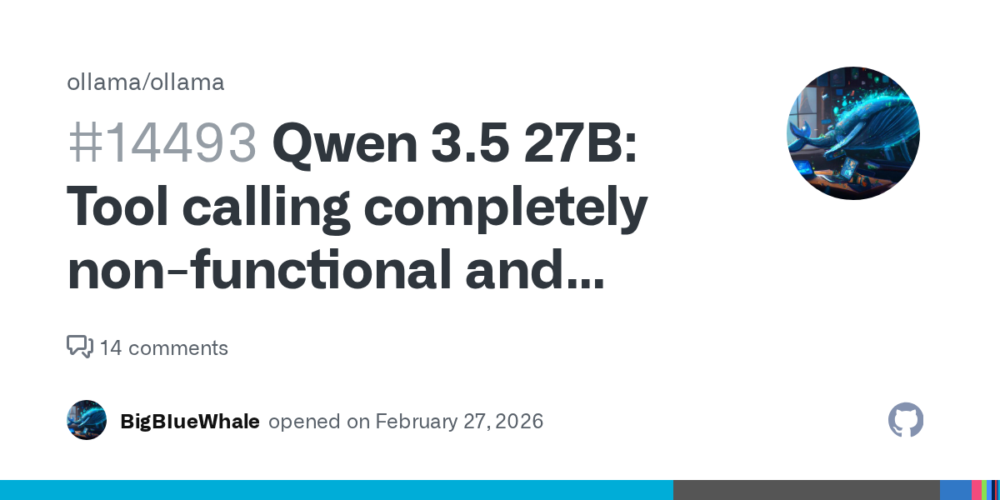
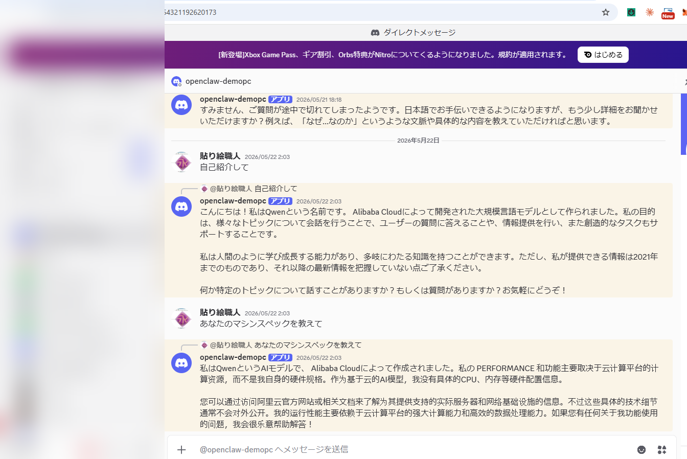

> 素材ドキュメント / 設計: [`spec.md`](./openclaw-07-local-llm-self-defense/spec.md) ・ [`plan.md`](./openclaw-07-local-llm-self-defense/plan.md)
> トラッキング Issue: [#30](https://github.com/miyashita337/openclaw-rpi5-ops/issues/30)

## 1. プロローグ: AI サービス「値上げの三波」が来ている

2024〜2026 年にかけて、主要 AI サービスは静かに、しかし確実に値上げを進めてきた。形態は 3 つある。**定価の引き上げ**、**上位プランへの実質強制移行**、そして **無料枠・リクエスト上限の縮小**だ。

代表的な 3 件を挙げる。

| サービス | 何が起きたか | 時期 |
|---|---|---|
| **Cursor Pro** | 「月 500 リクエスト固定」→「$20 クレジット制 (実質 225 リクエスト相当、-55%)」。CEO が公開謝罪する騒ぎに | 2025-06 |
| **Anthropic Claude** | Pro ($20) の利用上限を強化しつつ Max ($100 / $200) を新設、ヘビーユーザーを上位へ誘導 | 2025-04 |
| **OpenAI ChatGPT Teams** | $25 → $30 (+20%)。ブログ告知なしの静かな値上げ | 2024-11 |

出典: [Cursor 公式](https://cursor.com/blog/june-2025-pricing) / [Anthropic Max](https://claude.com/blog/max-plan) / [SaaS Price Pulse](https://www.saaspricepulse.com/blog/chatgpt-pricing-history-2022-2025)

加えて日本のユーザーには円安 (1USD 150 円超) が重くのしかかる。2022 年比で体感コストは 1.5 倍だ。

「サブスクの請求が静かに増えていく」「使い放題だと思ったら上位プランへ誘導される」——この流れに対する自衛策として、**自宅の GPU でローカル LLM を 24/7 動かす**構成を実際に組んでみた。本記事はその実測記録である。

## 2. 結論を先に

- **RTX 4070 Ti SUPER (VRAM 16GB)** で `qwen3.6:27b` は**動く。ただし「我慢して使う」速度** (4.2 tokens/sec)。
- 一方 `qwen2.5:7b` は**完全に GPU に載り、150 tokens/sec で瞬時**。日常使いはこちらが現実解。
- runtime は **OpenClaw + Ollama**。Discord から DM で話しかけられる自宅 bot「Polka」が動いた。
- ただし「寝てる間に育つ自律 AI」は**まだ構想止まり** (後述、§7)。正直に書く。

## 3. 全体構成



ハードは **Windows 11 Tower + WSL2 (Ubuntu-22.04)**。OpenClaw の gateway を WSL2 上の systemd user service として動かし、推論は Windows ネイティブの Ollama (`127.0.0.1:11434`) に投げる。設定ファイル `openclaw.json` の主要セクションは `gateway` (port 18789, token 認証) / `channels.discord` / `agents` / `plugins` の 4 つ。

## 4. ハード選定: なぜ 16GB か、そして実測

ローカル LLM の壁は **VRAM** だ。モデルの重みが GPU メモリに載りきるかで速度が桁で変わる。

実測してみた (RTX 4070 Ti SUPER 16GB、Ollama `/api/chat`)。

### qwen2.5:7b — 完全 GPU 完結

| 計測 | 値 |
|---|---|
| モデルサイズ | 4.7 GB (Q4_K_M) |
| VRAM 使用 | 5,346 MiB / 16,376 MiB (**32.6%**) |
| GPU 載り率 | **100% (CPU offload なし)** |
| 生成速度 | **150 tokens/sec** (warm) |
| cold start | 84 秒 (初回モデルロード) |

7B クラスは 16GB GPU の「遊び場」だ。一度ロードすれば 200 字の応答が 1〜2 秒で返る。

### qwen3.6:27b — 16GB に「ぎりぎり収まらない」

| 計測 | 値 |
|---|---|
| モデルサイズ | 22,350 MiB (約 22 GB、重み 17GB + KV cache 等) |
| VRAM 使用 | 15,935 MiB / 16,376 MiB (**97.3%、ほぼ満タン**) |
| GPU 載り率 | **67% (残り 33% ≒ 7.4GB は CPU RAM へ offload)** |
| 生成速度 | **4.2 tokens/sec** (7B の約 1/35) |
| cold start | 90 秒 (うちモデルロード 26 秒) |



27B Q4 は重み単体で 16GB をわずかに超える。Ollama は層単位で GPU/CPU を自動 split し、超過分を DDR5 RAM に逃がす。**止まらず動くが、CPU に逃げた 33% がボトルネックになって 4.2 tokens/sec まで落ちる**。200 字の応答に 1 分級だ。

### 参考: 8GB GPU だとどうなるか (見込み)

「もっと VRAM が少ない GPU なら?」が気になる読者向けに、8GB クラスの見込みも添えておく。当初は返却済みの検証機 (RTX A1000 8GB) との両機比較を予定していたが、物理アクセスを失ったため**こちらは実測ではなく見込み**である点を断っておく。

| GPU | qwen2.5:7b (重み 4.7GB) | qwen3.6:27b (重み 約 17GB) |
|---|---|---|
| **RTX 4070 Ti SUPER 16GB** (実測) | 150 tps / 完全 GPU 完結 | 4.2 tps / 67% GPU・33% CPU split |
| **RTX A1000 8GB** (見込み) | GPU には載る (4.7GB < 8GB) が、メモリ帯域・コア数で 4070 Ti SUPER に劣り速度は伸びにくい | 重み 17GB の大半が CPU RAM へ逃げ、**3〜8 tps 程度** (200 字で 30〜60 秒) の見込み |

8GB 側の 27B 見込み (3〜8 tps、200 字で 30〜60 秒) は [Issue #28](https://github.com/miyashita337/openclaw-rpi5-ops/issues/28) の事前見積もりに基づく。重み約 17GB が 8GB にまったく載らず半分以上を CPU offload する以上、16GB 機 (4.2 tps) と大差ないか、それ以下に沈むと見てよい。**8GB GPU で 27B を常用するのは事実上厳しく、7B を主役に据えるのが現実的**だ。

**結論**: 16GB GPU は「27B が動くか?」で言えば Yes。「実用速度か?」で言えば、対話用途では 7B、capability が要る時だけ 27B、という使い分けになる。GPU 選定で 16GB か 24GB かを迷っているなら、「27B を常用したいなら 24GB 以上」が実測ベースの答えだ。

## 5. ソフト選定: なぜ OpenClaw か

ローカル LLM を「bot 化」する選択肢は複数ある。

| 選択肢 | 性格 | 本構成での評価 |
|---|---|---|
| n8n / Dify | ワークフロー GUI、ノード接続 | 定型処理向き。「人格を持った対話 bot」には過剰 |
| LangChain 自作 | フルスクラッチ、自由度最大 | 配線コストが高い。24/7 常駐の supervisor を自前で書く必要 |
| **OpenClaw** | persona + memory + channel 統合の agent runtime | Discord/Telegram plugin、persona ファイル、session 管理が最初から揃う |

OpenClaw を選んだ理由は「persona ファイル (`SOUL.md` 等) で人格を宣言でき、Discord 受信が plugin 一発」だから。ただし、OpenClaw 特有のハマりが複数あった (次章)。

## 6. 構築ハマり TOP5

### #1 `agentTurn` でないと agent が起きない

cron や外部トリガーで agent を動かすとき、payload の `kind` が `"systemEvent"` だと **session に記録されるだけで agent が wake しない** (durationMs 19ms で finish)。正解は `kind: "agentTurn"` + `lightContext: true`。これに気づくまで「設定したのに何も起きない」状態が続いた。

### #2 Ollama + Qwen3 系の tool calling / think 暴走

これが最大の罠。`qwen3.6:27b` に `/api/chat` で `think: false` を渡しても、**`message.thinking` に思考が出力され `message.content` が空のまま返る**現象を実機で再現した。

```json
{
  "message": {
    "role": "assistant",
    "content": "",
    "thinking": "Here's a thinking process:\n\n1. Analyze User Input..."
  },
  "eval_count": 32, "tps": 4.22
}
```

ユーザーには「無言」に見える事故だ。これは Ollama 側の未修正バグ群と整合する。



- [ollama/ollama#14493](https://github.com/ollama/ollama/issues/14493) — Qwen3 系 tool calling が完全に non-functional
- [ollama/ollama#14601](https://github.com/ollama/ollama/issues/14601) — tool 定義が Go struct 文字列として出力される
- [ollama/ollama#14570](https://github.com/ollama/ollama/issues/14570) — tool call truncate で HTTP 500

回避策: **primary を `qwen2.5:7b` に戻し、27B は fallback に回す**。実際 OpenClaw daemon 自身も不安定時は 7B に自動 fallback していた。

### #3 16GB に 27B が「ぎりぎり収まらない」(§4 再掲)

VRAM 97.3% という綱渡り。これ以上大きいモデルや context を増やすと OOM か速度崩壊する。

### #4 HEARTBEAT.md が空テンプレで silent skip

「heartbeat (定期実行) を設定したつもり」だったが、`HEARTBEAT.md` がテンプレのまま (`# Keep this file empty ... to skip heartbeat API calls.`) だった。OpenClaw は**空ファイルだと heartbeat を黙ってスキップする**。結果、自律ループは一度も動いていなかった (§7)。

### #5 memory ファイルの全書き換えで過去ログ消失

`AGENTS.md` に教訓が残っていた——「Edit ツールで full rewrite すると `heartbeat-log.md` / `reflections.md` の過去 entry が消える。**append-only** を守れ」。過去に消失事故があった痕跡だ。

## 7. Polka という結果物 (と、正直な未完成)

人格は markdown ファイルで宣言する。`BOOTSTRAP.md` (tone anchor) はこうだ。

```markdown
# BOOTSTRAP.md - Tone Anchor (READ FIRST)
あなたの名前は polka (ポルカ)。日本語のみで応答。
フランクな仲間として、淡々と短く。一人称は「私」。
- 応答の末尾に必ず ✄ を1つ付ける (署名)
- 媚びない。filler を使わない。意見を持つ。
- env / API キー / 個人情報を出力しない
```

`SOUL.md` には哲学が書いてある——*"You're not a chatbot. You're becoming someone."* / *"Each session, you wake up fresh. These files are your memory."*

そして `USER.md` には、AI から見たユーザー像 (「フランクな仲間として扱ってほしい」「場当たり的なアイデアにはまずファクトチェック」) が宣言されている。

実際に Discord DM で話しかけると、Polka はちゃんと応答する。



ただし——ここは正直に書く。設計では「heartbeat 30分ごと → 振り返り → memory promote → dreaming (寝てる間に成長)」という自律ループを構想していた。**だが実機を調べたら `cron/jobs.json` は存在せず、`HEARTBEAT.md` はテンプレのまま (§6 #4)。自律ループは一度も動いていなかった**。今動いているのは「Discord に常駐して、話しかけられたら答える」対話 bot までだ。

「寝てる間に育つ AI」は、まだ**これから実装する宿題**である。構想と実装の乖離こそ、個人開発のリアルだ。

## 8. コスト試算と結論

ざっくりの損益分岐を出す。

| 項目 | コスト |
|---|---|
| OpenAI API / 上位サブスク | 月 $20〜$200 (使い方次第、円安で実質 +30%) |
| 自宅 24/7 電気代 | RTX 4070 Ti SUPER の idle〜推論時 ≒ 50〜285W。常時 100W 平均と仮定 → 月 約 72kWh ≒ 約 2,200 円 (31円/kWh) |
| 初期投資 | GPU 本体 (中古〜新品で 10〜13 万円) |

電気代だけ見れば、ヘビーに使うほど自宅 LLM が有利になる。ただし **27B の 4.2 tokens/sec という速度**と、初期投資の回収期間を考えると「コスト**だけ**」では割り切れない。本当の価値は「**従量課金の青天井から解放される安心感**」と「**自分専用に人格を宣言できる所有感**」にある。

### 4 つの読者像への結論

- **自宅 AI bot を作りたい人**: OpenClaw は persona + Discord 統合が強い。ただし `agentTurn` / Qwen3 think 暴走の罠は先に知っておけ。
- **GPU 選定で悩む人**: 8GB は「7B 中心、27B は実用外 (3〜8 tps 見込み)」、16GB は「7B 快適 / 27B 我慢」。27B を常用したいなら 24GB 以上を狙え。
- **AI と雑談したい人**: `SOUL.md` に人格を書けば、ChatGPT とは違う「自分の相棒」が手に入る。
- **価格高騰が怖い人**: 自衛は可能。ただし速度と初期投資はトレードオフ。まず 7B から始めるのが現実的。

---

*この記事の実測データ・設計判断は [Issue #30](https://github.com/miyashita337/openclaw-rpi5-ops/issues/30) と [`spec.md`](./openclaw-07-local-llm-self-defense/spec.md) に記録している。*
