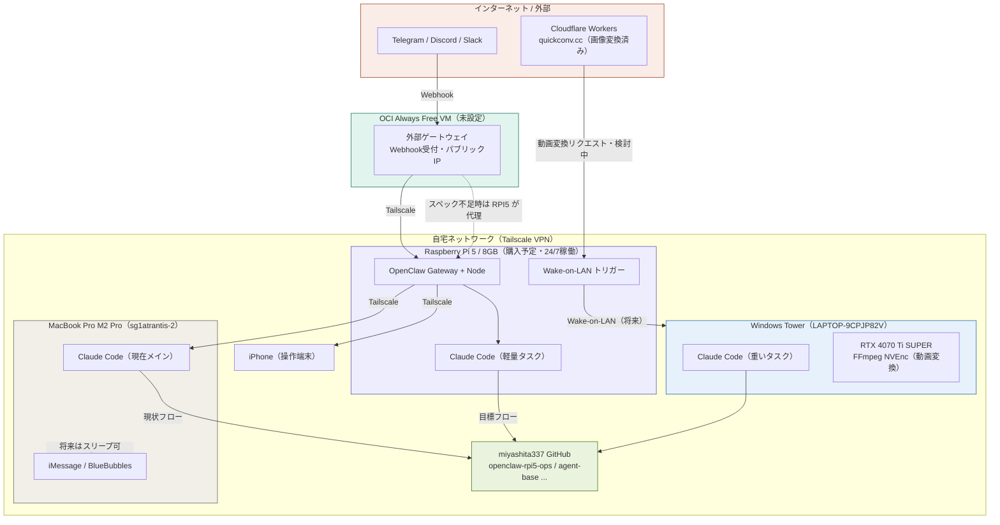
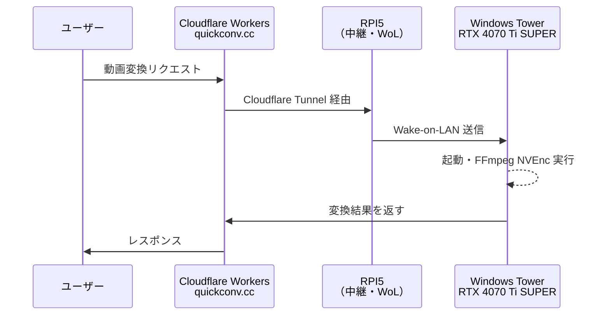

# OpenClaw + Raspberry Pi 5 プロジェクト概要
> Windows Claude / 新規参加者向け・ゼロから理解できる資料
> 作成日：2026-04-12 / 更新日：2026-04-12 v3

---

## 1. このプロジェクトは何か

**個人開発者（Hiroyuki Miyashita / harieshokunin）が、AIエージェント「OpenClaw」を自宅ハードウェアで24/7稼働させ、リポジトリ開発・運用・自動化を実現するプロジェクト。**

- Claude Codeでは難しかった「デスクトップ操作・スクリーンショット・自律的リリース」を、OpenClaw + RPI5 + 既存環境で実現する
- 個人事業主としての開発速度と品質向上が最終目標

---

## 2. 全体構成図



### フェーズ別の読み方

| フェーズ | 内容 |
|---|---|
| **現状** | MacBook が OpenClaw 代理稼働中・RPI5 未着 |
| **目標** | RPI5 → Claude Code → GitHub 直接フロー / MacBook スリープ可 |
| **将来** | RPI5 WoL → Windows Tower GPU 処理 / quickconv.cc 動画変換 |

---

## 3. 現在の保有デバイス一覧

| デバイス | 名前 | スペック | 役割 | 状態 |
|---|---|---|---|---|
| MacBook Pro | sg1atrantis-2 (macOS 15.7.4) | M2 Pro | メイン開発機（将来はスリープ可） | 毎日使用中 |
| Windows Tower | LAPTOP-9CPJP82V (Windows 11) | Ryzen 7 7700 + RTX 4070 Ti SUPER + 32GB DDR5 | 重い処理・Claude Code・GPU処理（WoL対象） | 稼働中 |
| iPhone | iphone174 (iOS 26.3.1) | — | 操作端末・iMessage | 稼働中 |
| OCI Always Free VM | — | ARM Ubuntu・パブリックIP | 外部ゲートウェイ第一候補 | 未設定 |
| **Raspberry Pi 5** | **購入予定** | **8GB・スターターキット** | **OpenClaw・Claude Code・24/7・WoLトリガー** | **Amazon注文予定** |

**Tailscale** で全デバイスが同一プライベートネットワークに接続済み（3台確認済み）。

---

## 4. 購入決定事項

### Raspberry Pi 5 スターターキット（8GB）
- **購入先**: Amazon（Vesonn JP 出品・Amazon 発送）
- **価格**: ¥31,964（税込）
- **セット内容**: 本体 8GB・公式ケース（ファン付き）・電源 5.1V/5A・64GB SD（OS 済み）・HDMIケーブル・アクティブクーラー

---

## 5. GitHubフロー：MacBook依存をなくす（目標）

```
以前：RPI5 → MacBook Pro → Claude Code → miyashita337 GitHub
目標：RPI5 → Claude Code（RPI5上） → miyashita337 GitHub
```

**可否：可能。** RPI5（ARM64）で Claude Code は動作する。
- 軽量タスク（GitHub push・issue管理・軽いコード編集）は RPI5 単独で完結
- 重いタスクは Windows Tower の Claude Code に転送する使い分けが現実的
- iMessage を使わない場合は MacBook のスリープが可能

---

## 6. quickconv.cc + Windows Tower 動画変換連携（検討中）

**現状**：quickconv.cc は Cloudflare Workers で画像変換まで対応済み。

**課題**：動画変換など GPU が必要な処理は Cloudflare では難しい。



**可否判断まとめ**：

| 項目 | 判定 | 備考 |
|---|---|---|
| Cloudflare Tunnel → Windows Tower | ✅ 技術的に可能 | cloudflared を Windows に導入 |
| RPI5 経由の Wake-on-LAN | ✅ 可能 | WoL パケット送信は RPI5 から可能 |
| FFmpeg + NVEnc（RTX 4070 Ti SUPER） | ✅ 可能 | CUDA 対応・高速エンコード |
| 自宅回線を本番バックエンドに | ⚠️ リスクあり | 停電・回線障害が本番障害になる |
| Windows の常時起動 vs WoL | △ 要検討 | WoL 設定は BIOS + ルーター設定が必要 |

→ **詳細設計は別セッションで Windows Tower の Claude Code に依頼する**

---

## 7. ランニングコスト（年間）

| 項目 | 年額 | 備考 |
|---|---|---|
| RPI5 電気代（7W・24/7） | 約 ¥1,900 | |
| OCI Always Free VM | ¥0 | Always Free 枠内 |
| Tailscale（Personal） | ¥0 | デバイス無制限 |
| Cloud API（Claude Max サブスク定額内） | ¥0 追加 | |
| Windows Tower（WoL・必要時のみ起動） | 最小化 | 常時起動は年 ¥27,000〜40,000 のため非推奨 |
| **合計（RPI5 稼働分）** | **約 ¥1,900** | |

---

## 8. OpenClaw でできること

| 機能 | 可否 | 備考 |
|---|---|---|
| メッセージ受信・返信 | ✅ | Telegram/Discord/Slack/iMessage 等 |
| Cloud API 中継（Claude/GPT） | ✅ | RPI5 はゲートウェイのみ |
| ブラウザ自動化（Chromium） | ✅ | 8GB で安定動作 |
| cron・定時タスク | ✅ | 毎朝ニュース収集・Slack 投稿等 |
| デスクトップ操作 | ✅ | macOS/Windows ノード経由 |
| スクリーンショット取得 | ✅ | iOS/macOS ノード経由 |
| GitHub 連携 | ✅ | Skills 経由 |
| Wake-on-LAN トリガー | ✅ | exec スキルでコマンド実行可 |
| **完全無人・ゼロタッチ開発** | ❌ | 人間の確認ステップが設計上必要 |

---

## 9. やりたいことリスト

### OpenClaw AIエージェント
- [ ] OpenClaw Gateway インストール・設定
- [ ] Tailscale 経由で OCI VM・MacBook と接続
- [ ] セキュリティ設定（bind・認証トークン・allowFrom）
- [ ] Telegram / Discord / Slack チャンネル接続
- [ ] iMessage 連携（MacBook の BlueBubbles 経由）
- [ ] cron 定時タスク（毎朝ニュース収集・要約・Slack 投稿）
- [ ] GitHub 連携（リポジトリ監視・PR 自動化）

### 外部公開・ゲートウェイ
- [ ] OCI VM を外部ゲートウェイとして設定（第一候補）
- [ ] OCI スペック不足の場合：RPI5 に Cloudflare Tunnel / Tailscale Funnel（代替）

### 開発自動化（Claude Code 連携）
- [ ] RPI5 に Claude Code インストール
- [ ] RPI5 単独で miyashita337 GitHub への push フロー確立
- [ ] agent-base を起点に OpenClaw → Claude Code 連携の最小構成
- [ ] iPhone から指示 → 自動実行・PR 作成

### quickconv.cc + Windows Tower（別セッションで設計）
- [ ] Cloudflare Tunnel → Windows Tower の接続確認
- [ ] Wake-on-LAN 設定（BIOS + ルーター）
- [ ] FFmpeg + NVEnc 動作確認（`ffmpeg -encoders | grep nvenc`）
- [ ] 動画変換リクエストの自動ルーティング実装

---

## 10. 管理リポジトリ一覧

| リポジトリ | 概要 |
|---|---|
| miyashita337/openclaw-rpi5-ops | **本プロジェクト総合管理（新規作成済み）** |
| miyashita337/agent-base | エージェント基盤テンプレート（最重要） |
| miyashita337/claude-context-manager | Claude セッション管理（Rust 製） |
| miyashita337/dev_tool | AutoHotkey v2・開発ツール集 |
| miyashita337/segment-anything | AI 画像セグメンテーション |
| miyashita337/video-qa | 動画 QA システム |
| miyashita337/obsidian_img_annotator | Obsidian 画像アノテーター |
| miyashita337/claude-hub | Claude ハブ |
| miyashita337/vive-reading | 読書系ツール |
| miyashita337/discord-markdown-enhancer | Discord Markdown 拡張 |
| miyashita337/team_salary | チーム給与管理 |
| miyashita337/team_salary_kdp | KDP 収益管理 |
| miyashita337/team_salary_digital | デジタル収益管理 |
| miyashita337/team_salary_trading | トレーディング管理 |
| miyashita337/oci_develop | OCI 開発環境 |

---

## 11. 次のアクション

### 今すぐ
1. Amazon で RPI5 スターターキット購入（¥31,964）
2. `openclaw-rpi5-ops` リポジトリへ本ファイルを push

### RPI5 到着後
3. Tailscale インストール → 既存 tailnet に追加
4. OpenClaw Gateway セットアップ（`docs/install/raspberry-pi` 参照）
5. Telegram チャンネル接続テスト
6. OCI VM 外部ゲートウェイ設定（または Cloudflare Tunnel 代替）
7. Claude Code インストール → GitHub push テスト

### 別セッション（Windows Tower Claude Code で）
- quickconv.cc + Windows Tower 動画変換連携の詳細設計・実装
- GitHub Projects（miyashita337）作成・全リポジトリ横断管理

### 新しいセッション用引き継ぎ文

```
RPI5-8GB スターターキット（Amazon ¥31,964）購入済み。
構成：OCI Always Free VM（外部ゲートウェイ第一候補・未設定）
     + RPI5-8GB（OpenClaw・Claude Code・24/7・WoLトリガー）
     + MacBook Pro M2 Pro（sg1atrantis-2・将来スリープ可）
     + Windows Tower（RTX 4070 Ti SUPER・重い処理・WoL対象）
     + Tailscale 全接続済み
目標：RPI5 → Claude Code → miyashita337 GitHub の直接フロー確立
次のタスク：[ここに具体タスクを入れる]
```

---

## 12. セキュリティ設定チェックリスト（OpenClaw 必須）

| 優先度 | 設定 | 内容 |
|---|---|---|
| 🔴 必須 | Gateway bind | `127.0.0.1` に変更 |
| 🔴 必須 | 認証トークン | 256bit 以上のランダムトークン |
| 🔴 必須 | allowFrom | 自分の番号/ID のみ許可 |
| 🔴 必須 | 最新版に更新 | CVE 138 件・41% が High/Critical |
| 🟡 推奨 | API キー分離 | `.env` ファイル化・`chmod 600` |
| 🟡 推奨 | elevated 制限 | 自分の ID のみに限定 |
| 🟡 推奨 | mDNS 最小化 | `OPENCLAW_DISABLE_BONJOUR=1` |

---

*更新：2026-04-12 v3 / Mermaid構成図・シーケンス図を追加。quickconv.cc WoL連携・RPI5直接GitHubフロー・MacBookスリープ可条件を反映*
